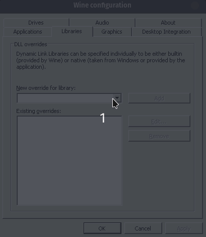

# Installation
The preferred BepInEx BE6.0.0 version is 385.

## Automatic Installation

1. Go to [https://github.com/SRXDModdingGroup/SRXDBepInExInstaller/releases/latest/](https://github.com/SRXDModdingGroup/SRXDBepInExInstaller/releases/latest/) and download the installer for your operating system.
2. Run the installer.
3. Put your mods in the `Spin Rhythm\BepInEx\plugins` folder.

## Manual Installation

If you get the error "failed to execute script srxdbepinexinstallerui" or installer not responding, try this method below to get it installed:

1. Navigate to `Steam\steamapps\common\Spin Rhythm`
2. Go to [https://builds.bepis.io/projects/bepinex_be](https://builds.bepis.io/projects/bepinex_be), scroll down to your preferred version and get the one that says "BepInEx Unity IL2CPP for Windows x64 Machines"
3. Extract the zip into your `Spin Rhythm` folder (`Steam\steamapps\common\Spin Rhythm`).
4. Go into the "BepInEx" folder that is now in your `Spin Rhythm` folder
5. Create a folder naned `unity-libs` inside of the BepInEx folder
6. Go to [https://github.com/LavaGang/Unity-Runtime-Libraries/raw/master/2020.1.15.zip](https://github.com/LavaGang/Unity-Runtime-Libraries/raw/master/2020.1.15.zip)
7. Download the zip and extract it into the just created "unity-libs" folder
8. Now navigate to `Spin Rhythm\BepInEx`
9. Create a `plugins` folder inside the BepInEx folder
10. Put your mods in the `Spin Rhythm\BepInEx\plugins` folder.

## Notes for Linux and Mac Users

__If you are on Linux or Mac, remember to add `winhttp` to the wine configuration overrides. Otherwise, BepInEx may not start with the game.__

Here's how to do that:
### Proton on Linux Users

```shell
# Set the Wine Prefix.
WINEPREFIX="/home/{Your Username}/.local/share/Steam/steamapps/compatdata/1058830/pfx"

# Run winecfg Using Proton.
"/home/{Your Username}/.local/share/Steam/steamapps/common/Proton {Your Proton Version}/dist/bin/wine64" winecfg
```

### Otherwise

```shell
winecfg
```

### Then Navigate to the Libraries Tab

